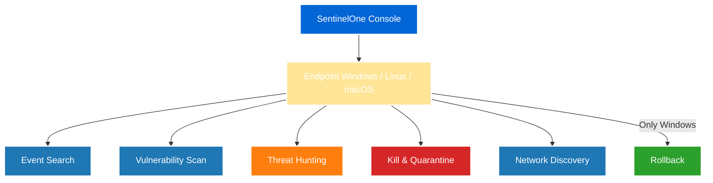
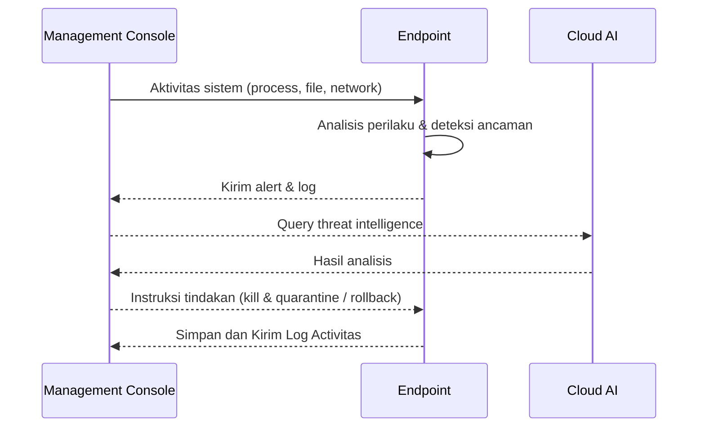

# Pengenalan SentinelOne

!!! info "Informasi"
    Disini akan membahas secara rinci dan lengkap serta implementasi langsung penggunaan [SentinelOne](https://sentinelone.com). Sebelumnya saya juga sudah membuat dokumentasi serupa [disini](https://salman-mustapa.github.io/s1-docs) terkait dengan setup, command, dan lainnya secara umum.

### 1. Apa itu SentinelOne

SentinelOne adalah platform keamanan endpoint berbasis AI (EDR/XDR) yang di rancang untuk mendeteksi, mencegah dan merespon ancaman siber secara otomatis.

SentinelOne bekerja secara proaktif dengan memanfaatkan analisis perilaku dan kecerdasan buatan (Purple AI), sehingga dapat menghentikan serangan zero-day dan malware tanpa file yang sering lolos dari solusi konvensional

**Fitur utama:**

* **Behavior-based Detection** – Mendeteksi ancaman berdasarkan pola perilaku, bukan hanya tanda tangan (signature).
* **Automated Response** – Mengisolasi (Quarantine), memblokir(Kill), dan memperbaiki sistem tanpa intervensi manual.
* **Cross-platform Support** – Mendukung Windows, macOS, dan Linux.
* **Ransomware Rollback** – Mengembalikan file yang terenkripsi ransomware ke kondisi sebelum serangan.
* **Threat Hunting** – Memungkinkan analisis forensik mendalam.
* **Network Discovery -** Mendeteksi dan Memetakkan jaringan, layanan, dan koneksi yang ada dalam segementasi jaringan yang sama.
* &#x20;**Event Search -** Menelurusi semua proses dan kejadian (event) yang ada di endpoint dan menggabungkannya kedalam console

### 2. Arsitektur & Komponen

SentinelOne terdiri dari beberapa komponen utama:

* **Node biru** → fitur observasi & analisis (Event Search, Vulnerability Scan, Network Discovery)
* **Node oranye** → fitur hunting ancaman
* **Node merah** → tindakan proteksi langsung
* **Node hijau** → pemulihan sistem

### 3. Alur Proses SentinelOne

!!! info "Informasi"
    ini hanyalah analogi dasar dari cara kerja SentinelOne, mulai dari pemantauan aktivitas endpoint, analisis ancaman secara otomatis, hingga pengambilan tindakan respons dan pemulihan. Setiap komponen berperan dalam memastikan keamanan sistem secara menyeluruh dan terintegrasi.