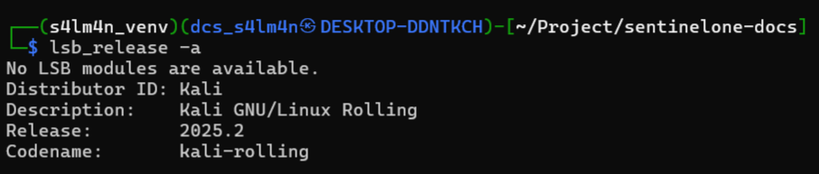
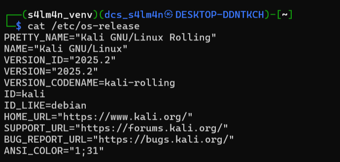
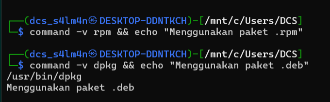
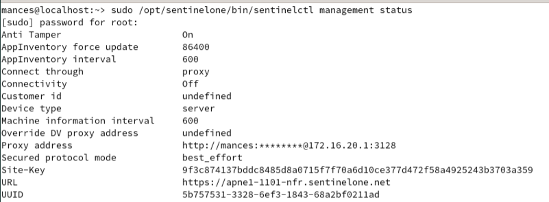

---
!!! info "Perhatikan Arsitektur Linux"
    Jika anda belum mengetahui arsitektur apa yang harus di gunakan maka gunakan perintah berikut untuk mengetahui apakah sistem operasi anda menggunakan .DEB atau .RPM

    ??? note "Cara Pertama"
        ```
        lsb_release -a
        ```
        
        Disini kita bisa tau kalau disini kita menggunakan kali linux, yang menggunakan based debian
    ??? note "Cara Kedua"
        ```
        cat /etc/os-release
        ```
        
        Disini kita dapat perhatikan pada `ID_LIKE=debian`. sehingga kita bisa simpulkan kalau ini menggunakan paket .deb
    ??? note "Cara Ketiga"
        ```
        command -v dpkg && echo "Menggunakan paket .deb"
        ```
        atau
        ```
        command -v rpm && echo "Menggunakan paket .rpm"
        ```
        
        Disini kita bisa langsung mengetahui kalau kita menggunakan paket .deb

=== ".DEB"
    - Format paket software untuk distro **Debian-Based** (Debian, Ubuntu, Kali Linux, Linux Mint dan lainnya)
    - Dikelola dengan menggunakan `dpkg` / `apt`
    - contoh filename: `sentinelone_agent_version_xxx.deb`
    ---
    ### Implementasi
    - Download paket instalasi pada console sentinelone misal xxxxx.sentinelone.net dan ke menu `Agent Management > Packages > Centang Paket .deb > Klik tab Actions > Download Packages`

        !!! info "Info"
            Menu ini menggunakan tampilan **Singularity Operations Center (Tampilan Baru SentinelOne)**

    - Silahkan pindahkan paket ke endpoint yang akan diinstall agent SentinelOne
    - Install agent dengan perintah
    ```
    sudo dpkg -i SentinelOne_Agent_Version_xxxx.deb
    ```

        !!! warning "Peringatan"
            Selama proses instalasi, SentinelOne akan melakukan proses pembuatan akun dengan user **`sentinelone`** dan menginstall paket paketnya dan akan membuat folder di **`/opt/sentinelone`**
    
    - Seting Tokennya agar agent menggunakan [policy](../pages/policy_settings.md) yang telah di atur pada console.
    ```
    sudo /opt/sentinelone/bin/sentinelctl management token set token_anda_xxx
    ```
    Untuk tokennnya anda dapat melihatnya pada menu
    **`Policy & Settings > Scope Info > Scope Token `**
    atau pada halaman yang sama ketika melakukan download **Agent** di bagian atas terdapat **`Scope Token`**. silahkan copy dan tempelkan ke Endpoint.
    jika tidak bisa melakukan copy dan paste, anda bisa menyimpannya pada sebuah file dan menggunakan **`$(cat path/token.txt)`** untuk mendapatkan tokennya sehingga syntax fullnya
    ```
    sudo /opt/sentinelone/bin/sentinelctl management token set $(cat path/token.txt)
    ```

    - setelah berhasil set tokennya, sekarang jalankan sentinelonenya agar dapat terhubung dengan console menggunakan perintah
    ```
    sudo /opt/sentinelone/bin/sentinelctl control start
    ```

    - jika sudah running, maka kita dapat memastikan agent telah terhubung dengan console dengan cara ke menu `Agent management > Endpoints` atau bisa mengetikan perintah berikut
    ```
    sudo /opt/sentinelone/bin/sentinelctl management status
    ```
    
    Jika sudah terhubung maka **`Connectivity`** nya sudah **`on`**. jika masih **`off`** berarti belum terhubung ke console sentinelone nya.
    
=== ".RPM"
    - Format paket software untuk distro **RetHat-Based** (RHEL, CentOS, Fedora, openSUSE, Amazon Linux dan lainnya)
    - Dikelola dengan menggunakan `rpm` / `zypper` / `yum` / `dnf`
    - contoh filename: `sentinelone_agent_version_xxx.rpm   `
    ---
    ### Implementasi
    - Download paket instalasi pada console sentinelone misal xxxxx.sentinelone.net dan ke menu `Agent Management > Packages > Centang Paket .rpm > Klik tab Actions > Download Packages`

        !!! info "Info"
            Menu ini menggunakan tampilan **Singularity Operations Center (Tampilan Baru SentinelOne)**

    - Silahkan pindahkan paket ke endpoint yang akan diinstall agent SentinelOne
    - Install agent dengan perintah
    ```
    sudo rpm -ivh SentinelOne_Agent_Version_xxxx.rpm
    ```

        !!! warning "Peringatan"
            Selama proses instalasi, SentinelOne akan melakukan proses pembuatan akun dengan user **`sentinelone`** dan menginstall paket paketnya dan akan membuat folder di **`/opt/sentinelone`**
    
    - Seting Tokennya agar agent menggunakan [policy](../pages/policy_settings.md) yang telah di atur pada console.
    ```
    sudo /opt/sentinelone/bin/sentinelctl management token set token_anda_xxx
    ```
    Untuk tokennnya anda dapat melihatnya pada menu
    **`Policy & Settings > Scope Info > Scope Token `**
    atau pada halaman yang sama ketika melakukan download **Agent** di bagian atas terdapat **`Scope Token`**. silahkan copy dan tempelkan ke Endpoint.
    jika tidak bisa melakukan copy dan paste, anda bisa menyimpannya pada sebuah file dan menggunakan **`$(cat path/token.txt)`** untuk mendapatkan tokennya sehingga syntax fullnya
    ```
    sudo /opt/sentinelone/bin/sentinelctl management token set $(cat path/token.txt)
    ```

    - setelah berhasil set tokennya, sekarang jalankan sentinelonenya agar dapat terhubung dengan console menggunakan perintah
    ```
    sudo /opt/sentinelone/bin/sentinelctl control start
    ```

    - jika sudah running, maka kita dapat memastikan agent telah terhubung dengan console dengan cara ke menu `Agent management > Endpoints` atau bisa mengetikan perintah berikut
    ```
    sudo /opt/sentinelone/bin/sentinelctl management status
    ```
    
    Jika sudah terhubung maka **`Connectivity`** nya sudah **`on`**. jika masih **`off`** berarti belum terhubung ke console sentinelone nya.
---
!!! success "Selamat"
    Anda telah berhasi melakukan instalasi agent pada endpoint. jika terjadi kendala pada instalasi anda dapat cek [Masalah Instalasi Agent Linux](../troubleshoots/installations/linux.md)
    